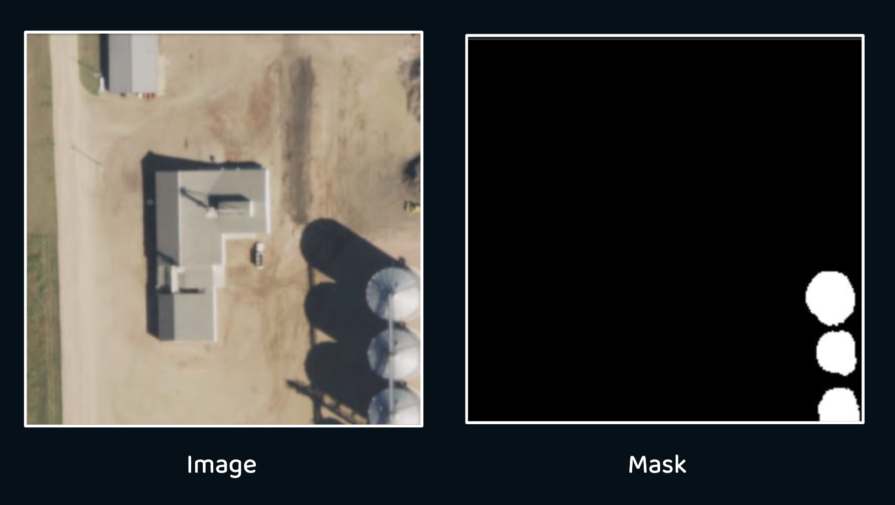
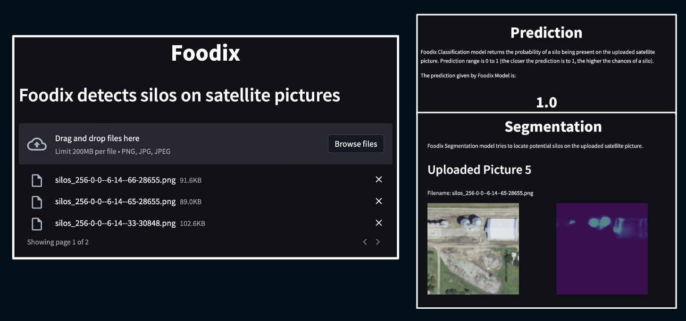
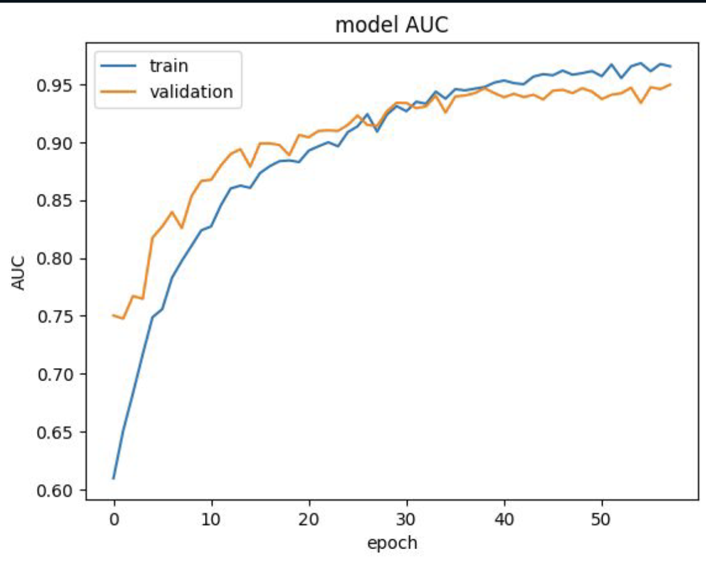
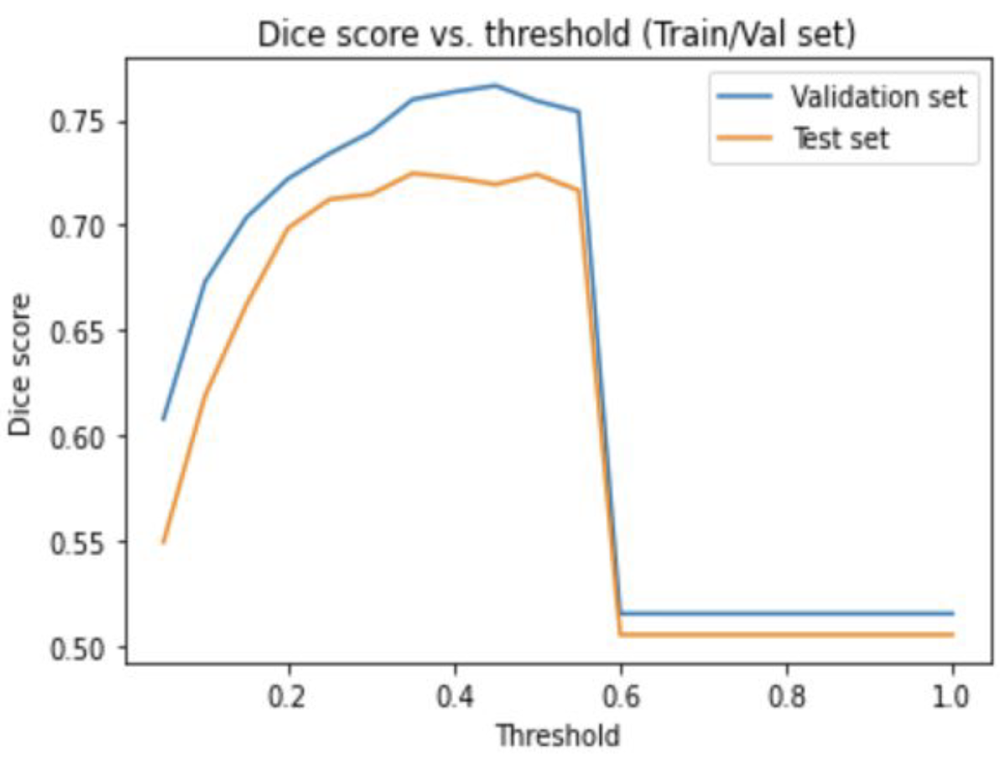

# Silos Detector (Mckinsey Quantum Black Hackathon)
This is a Computer Vision Hackathon led by Mckinsey Quantum Black (2023).
The goal was to imagine a tech start-up named Foodix leveraging machine learning to detect silos and track their condition in real time.

## Description

Tech side of the project was composed of two parts:
- Image Classification (Silos Detection): using CNN with Adam
optimizer and Binary Cross Entropy loss

- Image Segmentation (Silos Location): using a U-Net CNN

## Demo

For final presentation, we built a web application using streamlit in order to perform live predictions and localisation of silos

## Results

- Image Classification: AUC of 0.93

- Image Segmentation: Dice coefficient of 0.75

## Run Locally

- Clone the project
- Install dependencies
~~~
pip install -r requirements.txt
~~~
- Install Package
~~~
pip install -e .
~~~
- Run streamlit app
~~~
streamlit run src/app.py
~~~

N.B: It's also possible to run through Docker following these commands:

~~~
docker build -t silos .
docker run silos
~~~

## Authors
- Lucas Chaix
- Simon Mack
- Charles Proye
- Youssef Jouini
- Adrian Tan
- Nathan Aïm

## License

[MIT](https://choosealicense.com/licenses/mit/)
